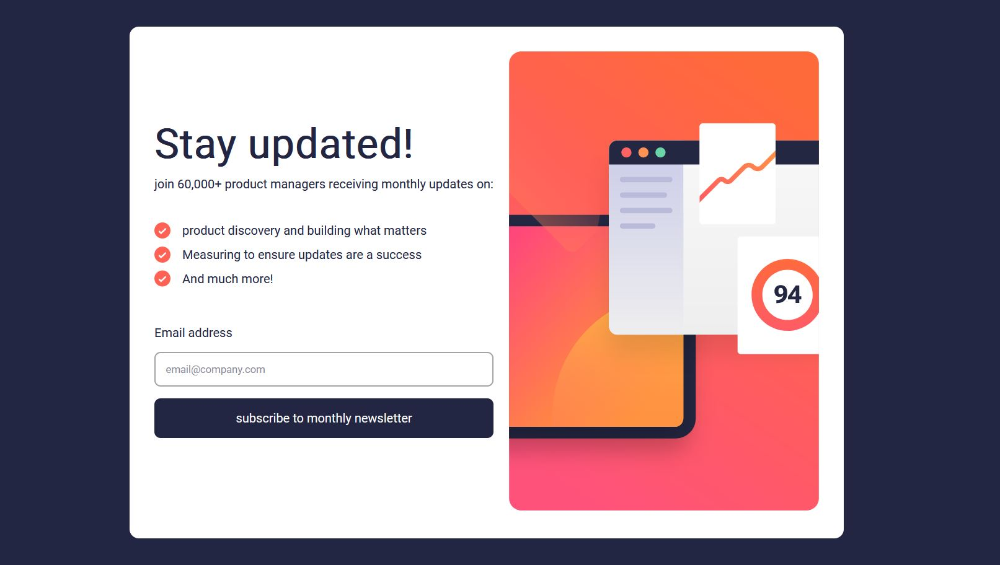

# newsletter-sign-up-with-success-message-main
This is a solution to the [Newsletter sign-up form with success message challenge on Frontend Mentor](https://www.frontendmentor.io/challenges/newsletter-signup-form-with-success-message-3FC1AZbNrv). Frontend Mentor challenges help you improve your coding skills by building realistic projects. 

## Table of contents

- [Overview](#overview)
  - [The challenge](#the-challenge)
  - [Screenshot](#screenshot)
  - [Links](#links)
- [My process](#my-process)
  - [Built with](#built-with)
- [License](#license)
- [Author](#author)

## Overview

### The challenge 🎯 

Users should be able to:

- Add their email and submit the form
- See a success message with their email after successfully submitting the form
- See form validation messages if:
  - The field is left empty
  - The email address is not formatted correctly
- View the optimal layout for the interface depending on their device's screen size
- See hover and focus states for all interactive elements on the page

### Screenshot

### Links

- Solution URL: [frontendmentor-newsletter-sign-up-with-success-message](https://www.frontendmentor.io/solutions/htmlcssjs-Ugg0vkvQye)
- Live Site URL: [newsletter-sign-up-with-success-message](https://hadi-sanei.github.io/mini-project-newsletter-sign-up-with-success-message-main)

## My process

### Built with

- 
- 
- 

## License

Distributed under the MIT License. See `LICENSE` for more information.

## Author

- Github - [Hadi Sanei](https://github.com/hadi-sanei)
- Frontend Mentor - [@hadi-sanei](https://www.frontendmentor.io/profile/hadi-sanei)

(<a href="#newsletter-sign-up-with-success-message">back to top</a>)
